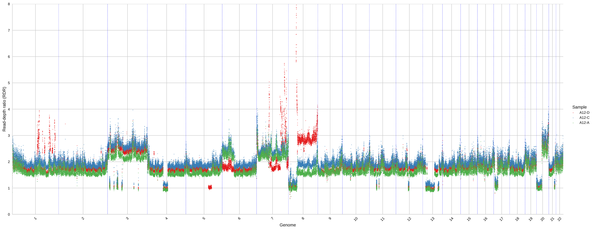
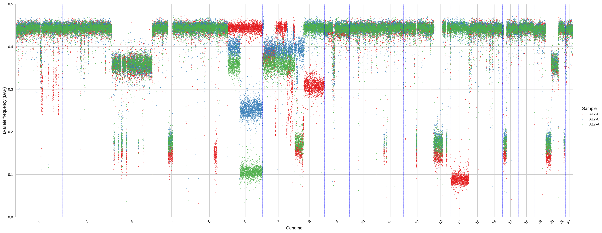

# plot-bins

This step produces informative plots concerning the computed RDRs, BAFs, and clusters.
The information produced by this step are important to validate the compute clusters of genomic regions and help to tune the parameters for better deal with special datasets.
plot-bins produces different plots which need to be specified by different commands and require different input.

When `plot_bins = True` is indicated in `hatchet.ini`, the command [`plot-bins-1d2d`](doc_plot_bins_1d2d.md) will also be run. This command produces alternate plots in which bins are colored by cluster and colors match across samples between the 2D cluster view and 1D genomic view.

## Input

plot-bins considers two different inputs which are tab-separated files, one is mandatory and the other is only required for certain command:

1. A file of clustered genomic bins, specified without any flag and with the following fields.

| Field | Description |
|-------|-------------|
| `CHR` | Name of a chromosome |
| `START` | Starting genomic position of a genomic bin in `CHR` |
| `END` | Ending genomic position of a genomic bin in `CHR` |
| `SAMPLE` | Name of a tumor sample |
| `RD` | RDR of the bin in `SAMPLE` |
| `#SNPS` | Number of SNPs present in the bin in `SAMPLE` |
| `COV` | Average coverage in the bin in `SAMPLE` |
| `ALPHA` | Alpha parameter related to the binomial model of BAF for the bin in `SAMPLE`, typically total number of reads from A allele |
| `BETA` | Beta parameter related to the binomial model of BAF for the bin in `SAMPLE`, typically total number of reads from B allele |
| `BAF` | BAF of the bin in `SAMPLE` |
| `CLUSTER` | The name of the corresponding cluster of the bin in `SAMPLE` |

2. A file of clusters, which is required only by commands and it is specified through the flag `-s`, `--segfile`. The file has the following fields.

| Field | Description |
|-------|-------------|
| `ID` | The name of a cluster |
| `SAMPLE` | The name of a sample |
| `#BINS` | The number of bins included in `ID` |
| `RD` | The RDR of the cluster `ID` in `SAMPLE` |
| `#SNPS` | The total number of SNPs in the cluster `ID` |
| `COV` | The average coverage in the cluster `ID` |
| `ALPHA` | The alpha parameter of the binomial model for the BAF of the cluster `ID` |
| `BETA` | The beta parameter of the binomial model for the BAF of the cluster `ID` |
| `BAF` | The BAF of the cluster `ID` in `SAMPLE` |

## Commands

A command must be specified using the flag `-c`, `--command` and every command is described in the following together with an example of the corresponding plot.

### RD

The command generates a scatter plot describing the RDR of every genomic bin in the different samples. For every genomic bin sorted by chromosome and by genomic positions, a point is plotted with the corresponding value of RDR and colored by a color identifying the corresponding sample.

    python -m hatchet plot-bins A12.bbc -c RD -m Set1 --figsize 9,2.5 --markersize 1 --ymax 8 --ymin 0

***

### BAF

The command generates a scatter plot describing the BAF of every genomic bin in the different samples. For every genomic bin sorted by chromosome and by genomic positions, a point is plotted with the corresponding value of RDR and colored by a color identifying the corresponding sample.

    python -m hatchet plot-bins A12.bbc -c BAF -m Set1 --figsize 9,2.5 --markersize 1 --ymax 8 --ymin 0

***

### BB

The command generates a series of 2d-scatter plots where x-axis corresponds to the mirrored BAF and the y-axis corresponds to RDR. More specifically, a plot is generated for every sample and every point is drawn according to the corresponding values of RDR and BAF. The points are colored according to their density from blue (low density) to dark red (high density).

    python -m hatchet plot-bins A12.bbc -c BB --figsize 8,6 --markersize 1 --xmax 3.5 --xmin 0.5

***

### CBB

The command generates a series of 2d-scatter plots where x-axis corresponds to the mirrored BAF and the y-axis corresponds to RDR. More specifically, a plot is generated for every sample and every point is drawn according to the corresponding values of RDR and BAF. The points are colored according to the clusters computed by HATCHet. Remember that a cluster contains all the genomic regions that have the same copy-number state in every clone.

    python -m hatchet plot-bins A12.bbc -c CBB --figsize 4,1.1 -m tab20 --markersize 1 --xmax 3.5 --xmin 0.5 --colwrap 3 -tS 0.005

***

### CRDR

The command generates a series of 2d-scatter plots where x-axis corresponds to the RDR and to bins sorted by chromosome and positions. More specifically, a plot is generated for every sample and every point is drawn according to the corresponding values of RDR. The points are colored according to the clusters computed by HATCHet. Remember that a cluster contains all the genomic regions that have the same copy-number state in every clone.

    python -m hatchet plot-bins A12.bbc -c CRD -m tab20 --figsize 9,2.5 --markersize 1 --ymax 8 --ymin 0

***

### CBAF

The command generates a series of 2d-scatter plots where x-axis corresponds to the BAF and to bins sorted by chromosome and positions. More specifically, a plot is generated for every sample and every point is drawn according to the corresponding values of BAF. The points are colored according to the clusters computed by HATCHet. Remember that a cluster contains all the genomic regions that have the same copy-number state in every clone.

    python -m hatchet plot-bins A12.bbc -c CBAF -m tab20 --figsize 9,2.5 --markersize 1 --ymax 8 --ymin 0

***

### Parameters

| Name | Description | Usage | Default |
|------|-------------|-------|---------|
| `-tC`, `--chrthreshold` | Threshold of chromosomes | A threshold can be specified to select to plot only genomic regions belonging to clusters that cover at least the specified number of chromosomes | 0, no threshold |
| `-tS`, `--sizethreshold` | Threshold of size | A threshold can be specified to select to plot only genomic regions belonging to clusters that cover at least the specified fraction of the genome | 0, no threshold |
| `--xmin` | Minimum x-value of plot | The value can be specified to fix the minimum value of x-axis of the plot | None |
| `--xmax` | Maximum x-value of plot | The value can be specified to fix the maximum value of x-axis of the plot | None |
| `--ymin` | Minimum y-value of plot | The value can be specified to fix the minimum value of y-axis of the plot | None |
| `--ymax` | Maximum y-value of plot | The value can be specified to fix the maximum value of y-axis of the plot | None |
| `--figsize` | Figure size in the format "(X, Y)" | The parameter is used to change the figure size. The meaning and scale of X and Y depend on the different plot so one needs to try different values. | Automatic values |
| `--markersize` | Size of the markers | The value is used to scale the size of the point markers | Automatic value |
| `-m`, `--colormap` | Name of the colormap to use | The following colormaps are available: {Set1, Set2, Paired, Dark2, tab10, and tab20} | tab20 |
| `--resolution` | Number of bins to merge | This feature allows plot-bins to merge multiple bins into segments whose copy numbers will be chosen by majority. This features allows to change the resolution of the plot. | 0, bins are not merged |
| `--colwrap` | Number of plots per each column | This value determines the maximum number of plots for multiple samples to print on the same row  | 2 |
| `--fontscale` | Scale for font size | The value is used to scale the font size | 1 |
| `-s`, `--segfile` | Path to cluster file | The cluster file, containing estimated values of RDR and BAF for each cluster in every sample is only required by `CLUSTER` command | None |
| `-x`, `--rundir` | Path to running directory | The running directory where output the results | Current directory  |
