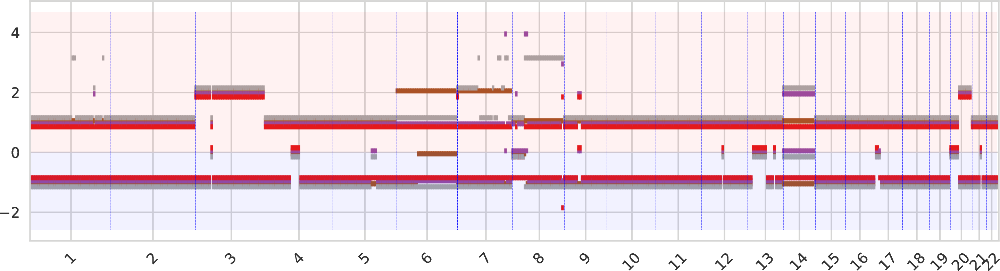
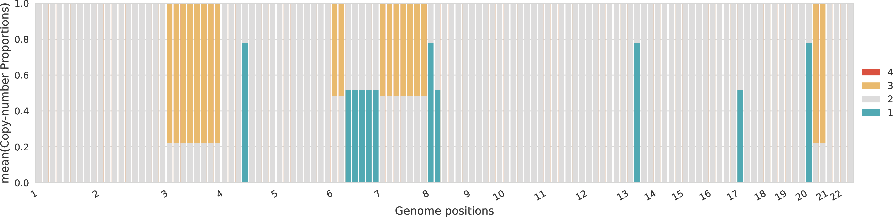
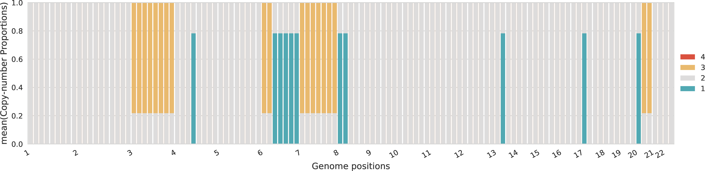
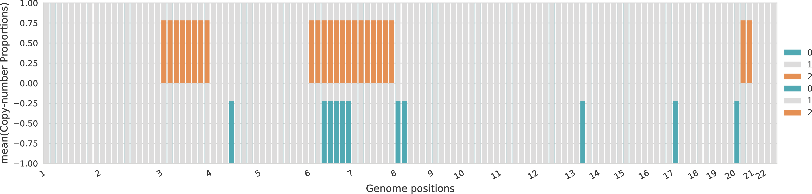
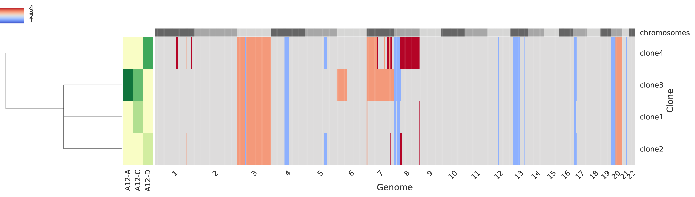

# plot-cn

This step analyzes the inferred copy-number states and clone proportions and produces informative plots jointly considering all samples from the same patient. In addition, this step can also combine results obtained for different patients and perform integrative analysis.
plot-cn produces several informative plots concerning the copy-number states and proportions for the inferred clones from multiple tumor samples of a patient.
In additionl, plot-cn can also produce some informative plots to compare the solutions obtained on different patients.

When `plot_cn = True` is indicated in `hatchet.ini`, the command [`plot-cn-1d2d`](plot_cn_1d2d.md) will also be run. This command produces alternate plots in which bins are colored by cluster and colors match across samples between the 2D cluster view and 1D genomic view. In addition, these plots show the expected positions of the assigned copy-number states as labeled points in the 2D plots and black bars in the 1D plots.

## Input

plot-cn considers in input one or more tab-separated files. Each of these files contains the inferred copy-number states and clone proportions for clustered genomic bins and has the following format:

| Field | Description |
|-------|-------------|
| `CHR` | Name of a chromosome |
| `START` | Starting genomic position of a genomic bin in `CHR` |
| `END` | Ending genomic position of a genomic bin in `CHR` |
| `SAMPLE` | Name of a tumor sample |
| `RD` | RDR of the bin in `SAMPLE` |
| `#SNPS` | Number of SNPs present in the bin in `SAMPLE` |
| `COV` | Average coverage in the bin in `SAMPLE` |
| `ALPHA` | Alpha parameter related to the binomial model of BAF for the bin in `SAMPLE`, typically total number of reads from A allele |
| `BETA` | Beta parameter related to the binomial model of BAF for the bin in `SAMPLE`, typically total number of reads from B allele |
| `BAF` | BAF of the bin in `SAMPLE` |
| `CLUSTER` | The name of the corresponding cluster of the bin in `SAMPLE` |
| `cn_normal` | The copy number state of the normal diploid clone equal to <code>1&#124;1</code> |
| `u_normal` | The normal admixture of the normal diploid cells in the corresponding sample |
| `cn_clone${n}` | The copy number state of the `${n}` tumor clone in the format <code>A&#124;B</code> where `A` and `B` are the two allele-specific copy numbers of the corresponding genomic bin |
| `u_clone${n}` | The clone proportion of the `${n}` tumor clone in the corresponding sample |

When a single file is speicified, the input is given directly and plot-cn runs in single-patient mode.
When multiple files are speicified, the files are given in a white-space separated list of filenames between "..." and plot-cn runs in multi-patient mode.

## Parameters

| Name | Description | Usage | Default |
|------|-------------|-------|---------|
| `-x`, `--rundir` | Outpud directory | Directory where the output files are generated | Current directory |
| `-n`, `--patientnames` | Names of the patients | White-space separated list of patient names is used when running in multi-patient mode | Inferred from file names |
| `-u`, `--minu` | Minimum CNA proportion | A minimum CNA proportion that is used as a minimum threshold to exclude CNA present in lower proportions from the plot | 0.2 |
| `-e`, `--threshold` | Tumor ploidy threshold for WGD/no WGD | This is the value of tumor ploidy which is used to determine either the absence or presence of a WGD which determine the basic copy number equal to either 2 or 4 | 3.0 |
| `-b`, `--baseCN` | Base copy number | Force base copy number to be equal to this value for determining the grey colors on plots | None, inferred tumor ploidy |
| `-sC`, `--figsizeclones` | Size of tumor-clone plots | The size should be given in the format `(X-SIZE, Y-SIZE)` | `(12, 3)` |
| `-sP`, `--figsizecn` | Size of copy-number plots | The size should be given in the format `(X-SIZE, Y-SIZE)` | `(16, 4)` |
| `-sG`, `--figsizegrid` | Size of grid plots | The size should be given in the format `(X-SIZE, Y-SIZE)` | `(20, 10)` |
| `-rC`, `--resolutionclones` | Resolution for tumor-clone plots | Number of bins that are merged together when plotting tumor-clone profiles | 100 |
| `-rP`, `--resolutioncn` | Resolution for copy-number plots | Number of bins that are merged together when plotting copy-number profiles | 500 |
| `-rG`, `--resolutiongrid` | Resolution for grid plots | Number of bins that are merged together for grid plots | 100 |
| `--ymax` | Maximum value in y-axis | Fix the maximum y-axis value | Automatically inferred |
| `--ymin` | Minimum value in y-axis | Fix the minimum y-axis value | Automatically inferred |
| `--clonepalette` | Name of color palette | Color palette to use for coloring tumor clones among the ones available, including `Set1, Set2, Set3, Paired` | `Set1` |
| `--linkage` | Linkage method | The linkage method to use for the clustering of the rows in grdin and tumor-clone plots, including \{single, complete, average, weighted, centroid, median, ward\} from SciPy | single |

## Single-patient (intra-tumor)

In the following, we report an example of all the plots produced in single-patient mode obtained by running the following command:

    python plot_cn.py A12.bbc.ucn -sG "(16,4)"

***

### Total copy numbers of tumor clones

The total copy number for every genomic region, sorted across chromosomes, with a color identifiying each tumor clone.
When the total copy numbers of different clones overlap the same value, the corresponding bars are slightly shifted.

***

### Allele-specific copy numbers of tumor clones

The allele-specific copy number for every genomic region, sorted across chromosomes, with a color identifiying each tumor clone.
The A-allele is represented in the top part and the B-allele in the bottom part (the negative sign should be ignored).
When the allele-specific copy numbers of different clones overlap the same value, the corresponding bars are slightly shifted.

***

###  Proportions of total copy numbers per sample

For each sample, the proportions across the different total copy numbers are represented for every genomic region.

***

###  Proportions of allele-specific copy numbers per sample

For each sample, the proportions across the different allele-specific copy numbers are represented for every genomic region.
The proportions of A-specific copy numbers are represented in the top part of the plot with positive values, while the proportions of B-specific copy numbers are represented in the bottom part of the plot with negative values.

***

### Copy-number profiles of tumor clones

Every row of the main grid corresponds to a tumor clone and the total copy number for each genomic region is represented, such that the regions are sorted across the crhomosomes represented on the top as alternating gray boxes.
A heatmap in the left side of the figure represents the clone proprtions across every sample (columns).
Also, on the left-most side of the figure a dendogram represents a clustering of the tumor clones.

***

### Reduced copy-number profiles of tumor clones

Every row of the main grid corresponds to a tumor clone and the corredponsing reduced total copy number for each genomic region is represented, such that the regions are sorted across the crhomosomes represented on the top as alternating gray boxes.
More specifically, a region is classified as:
- 0 when the total copy number is equal to the base
- -1 when it corresponds to a deletion (total copy number lower than base)
- 1 when it corresponds to an amplification (total copy number higher than base).

A heatmap in the left side of the figure represents the clone proprtions across every sample (columns).
Also, on the left-most side of the figure a dendogram represents a clustering of the tumor clones.

***

### Mixture profiles of tumor samples

Every row of the main grid corresponds to a tumor sample and the corredponsing reduced-fractional copy number for each genomic region is represented, such that the regions are sorted across the crhomosomes represented on the top as alternating gray boxes.
More specifically, the fractional copy number are computed from the mixed profiles.
A heatmap in the left side of the figure represents the clone proprtions across every sample (columns).
Also, on the left-most side of the figure a dendogram represents a clustering of the tumor samples.

***

### Subclonality

This plot is not currently functioning properly.

***
